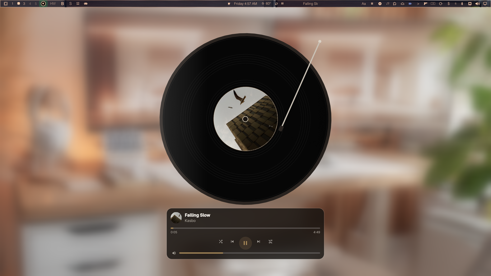

# Vinyl Player


A large playing vinyl for the [Omarchy](https://omarchy.org) desktop.

The record sits on the Bottom layer — on top of [wallpaper.blur](https://github.com/maiosx/wallpaperblur), under every window. Spotmarchy’s transport (seek, shuffle, previous, play/pause, next, repeat, volume) is docked along the bottom of the disc. Click the record itself to play or pause.

Pair it with wallpaper.blur so the platter has something to sit on.

## Install

```sh
omarchy plugin add https://github.com/maiosx/vinyl-player.git --enable
omarchy plugin add https://github.com/maiosx/wallpaperblur.git --enable
omarchy restart shell
```

Or let the install script do both and restart the shell:

```sh
curl -fsSL https://raw.githubusercontent.com/maiosx/vinyl-player/main/install | bash -s -- --yes
```

| | |
|---|---|
| **Plugin id** | `vinyl.player` |
| **Requires** | Omarchy 4 (the Quickshell shell) |
| **Where** | Every screen, the Bottom layer, above wallpaper.blur |
| **Bar** | A small record (center section by default) — click to toggle |
| **Network** | Cover art only (same `scdn.co` gate as Spotmarchy) |

Nothing else is required to play music. Spotify is reached over MPRIS (`org.mpris.MediaPlayer2.spotify`) through Quickshell’s own service. `spotifyd` and `spotify-player` are matched too; any other playing MPRIS client is used as a fallback so the record keeps turning.

Cover art wants `magick` (the `imagemagick` package) and `curl`. Without them the label stays cream and the disc still spins.

Suggested keybind in `~/.config/hypr/bindings.lua`:

```lua
o.bind("SUPER + V", "vinyl.player", "omarchy-shell vinyl.player toggle")
```

> **`omarchy plugin add` does not upgrade.** It refuses when the plugin is already installed. Use `update` (below) or re-run the install script.

### From a local copy

```bash
cp -r vinyl-player ~/.config/omarchy/plugins/vinyl.player
omarchy plugin enable vinyl.player
omarchy restart shell
```

## Updating

```bash
~/.config/omarchy/plugins/vinyl.player/update
```

Or by hand:

```bash
omarchy plugin update vinyl.player
omarchy restart shell
```

## Uninstall

```bash
omarchy plugin disable vinyl.player
omarchy plugin remove vinyl.player
```

## Using it

The vinyl is a desktop object, not a popup. Clicks on the empty wallpaper pass straight through; only the record and the transport card take input.

| Action | Where |
|--------|-------|
| Play / pause | Click the disc, or the play button, or right-click the bar record |
| Open / close the vinyl | Left-click the bar record, or `vinyl.player toggle` |
| Previous / next | Transport buttons under the disc |
| Seek | Click the progress hairline |
| Volume | Drag the volume hairline |
| Shuffle / repeat | The outer two transport buttons |

The bar widget is a 16px record. It spins and takes the accent colour while a track is playing, and dims when the vinyl is hidden.

## How it sits on wallpaper.blur

[wallpaper.blur](https://github.com/maiosx/wallpaperblur) draws a blurred copy of the current wallpaper on `WlrLayer.Background`, under the real wallpaper and every other widget.

Vinyl Player draws on `WlrLayer.Bottom` — the next layer up — with `exclusiveZone: 0` and a mask that is only the disc plus the transport card. The rest of the surface is empty, so the blur (and the desktop) stay visible around the record. It is not a fullscreen overlay.

If wallpaper.blur is not installed the vinyl still works; it just sits on the ordinary wallpaper.

## IPC

```sh
omarchy-shell vinyl.player toggle
omarchy-shell vinyl.player enable
omarchy-shell vinyl.player disable
omarchy-shell vinyl.player getEnabled
omarchy-shell vinyl.player playPause
omarchy-shell vinyl.player next
omarchy-shell vinyl.player previous
omarchy-shell vinyl.player shuffle
omarchy-shell vinyl.player loop
omarchy-shell vinyl.player launch
omarchy-shell vinyl.player status
```

## Tuning

Properties at the top of `Surface.qml`:

| | |
|---|---|
| `discSize` | Diameter of the record, in pixels (default 560) |
| `showTonearm` | The arm that drops onto the disc while playing |
| `hideWhenClosed` | Hide the vinyl entirely when nothing is playing |
| `accent` | Fallback accent when album colour has not been measured |

Properties at the top of `BarWidget.qml`:

| | |
|---|---|
| `defaultIconScale` | `1` or `2` — doubles the bar record's size for displays where the default 16px glyph reads too small. Used automatically if the bar framework passes `settings.iconScale`; otherwise this is the value. |

Edit, then `omarchy restart shell`.

## The album cover

Cover URLs are treated as hostile, using Spotmarchy’s probe unchanged: only `https://` on `scdn.co` (label-boundary match) and local `file://` paths are fetched; the probe re-encodes a 640px PNG into `$XDG_CACHE_HOME/vinyl-player/covers`; the QML `Image` elements load that file and never the raw art URL. `node test/model-test.js` asserts that against `Surface.qml`.

## Development

```bash
node test/model-test.js     # player matching, label, probe parsing, colour maths
omarchy plugin validate .   # manifest against the Omarchy schema
omarchy restart shell       # required after a QML edit (`keepLoaded`)
```

`Model.js` has no Qt in it, so the tests run under node.

---

MIT. See [LICENSE](LICENSE). Transport and the art-probe gate are adapted from [Spotmarchy](https://github.com/mich-nduka/spotmarchy). Layering follows [wallpaper.blur](https://github.com/maiosx/wallpaperblur).
